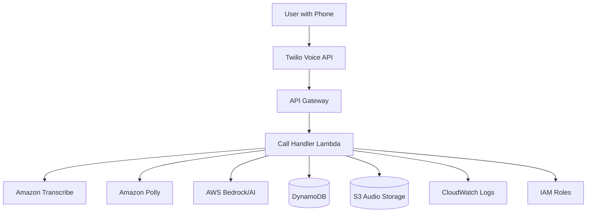

# Design Document

## Overview

PromptCall AI MVP is a voice-to-AI conversational platform that enables users to access AI assistance through phone calls. The system integrates telephony services, speech processing, and AI language models to provide a seamless voice-based AI experience over traditional phone networks.

The architecture follows a microservices approach with clear separation of concerns: call handling, speech processing, AI integration, and session management. The system is designed to be cost-effective, scalable, and reliable for users with basic mobile phones.

## Architecture

### High-Level Architecture



### Technology Stack

- **Telephony**: Twilio Voice API for call handling and audio streaming
- **Compute**: AWS Lambda functions for serverless processing
- **API Gateway**: AWS API Gateway for webhook endpoints
- **Speech-to-Text**: Amazon Transcribe for voice-to-text conversion
- **Text-to-Speech**: Amazon Polly for natural speech synthesis
- **AI Engine**: AWS Bedrock (Claude/GPT integration) for AI processing
- **Database**: Amazon DynamoDB for session and conversation storage
- **Audio Storage**: Amazon S3 for temporary audio file storage
- **Orchestration**: AWS Lambda with CloudWatch for monitoring

## Components and Interfaces

### 1. Call Handler Lambda Function

**Responsibilities:**
- Manage incoming calls through telephony provider webhooks
- Orchestrate the conversation flow using AWS services
- Handle call state and session management in DynamoDB
- Coordinate between Transcribe, Bedrock, and Polly services

**Key Endpoints (via API Gateway):**
```javascript
// Handle incoming call
POST /webhook/voice
- Answers call and plays welcome message
- Initiates speech recording and stores audio in S3

// Process speech input
POST /webhook/speech
- Triggers Transcribe job for audio file
- Sends transcribed text to Bedrock for AI processing
- Uses Polly to convert response to speech
- Returns TwiML/XML response to telephony provider

// Handle call events
POST /webhook/events
- Manages call completion, errors, and timeouts
- Updates DynamoDB session records
```

### 2. Amazon Transcribe Integration

**Responsibilities:**
- Convert user speech to text using AWS Transcribe
- Handle audio quality issues and noise filtering
- Provide confidence scores for transcription accuracy

**Implementation:**
```javascript
class TranscribeService {
  async transcribeAudio(s3AudioUrl, sessionId) {
    // Start Transcribe job with S3 audio file
    // Returns: { text: string, confidence: number }
  }
  
  async handleLowConfidence(s3AudioUrl, sessionId) {
    // Retry with enhanced audio settings
  }
  
  async pollTranscriptionJob(jobName) {
    // Poll Transcribe job status until complete
  }
}
```

### 3. AWS Bedrock AI Integration

**Responsibilities:**
- Process user queries using AWS Bedrock (Claude/GPT models)
- Maintain conversation context in DynamoDB
- Ensure responses are concise and phone-appropriate

**Implementation:**
```javascript
class BedrockService {
  async processQuery(text, sessionContext) {
    // Call Bedrock API with conversation context
    // Returns: { response: string, context: object }
  }
  
  async optimizeForVoice(response) {
    // Ensure response is suitable for Polly TTS and call duration
    // Limit to 60 seconds of speech (~150 words)
  }
  
  async buildPrompt(userQuery, conversationHistory) {
    // Create system prompt optimized for voice responses
  }
}
```

### 4. Amazon Polly Integration

**Responsibilities:**
- Convert AI responses to natural speech using Amazon Polly
- Optimize audio quality for phone calls
- Store generated audio in S3 for telephony playback

**Implementation:**
```javascript
class PollyService {
  async synthesizeSpeech(text, voiceSettings) {
    // Call Polly API to generate speech
    // Store audio file in S3
    // Returns: S3 URL for audio playback
  }
  
  async optimizeForTelephony(text) {
    // Add SSML tags for phone call optimization
    // Adjust speech rate and volume for clarity
  }
  
  async getOptimalVoice() {
    // Return best Polly voice for telephony (e.g., Joanna, Matthew)
  }
}
```

### 5. DynamoDB Session Manager

**Responsibilities:**
- Track call sessions and conversation state in DynamoDB
- Manage call duration and billing information
- Handle session recovery for dropped calls

**Implementation:**
```javascript
class DynamoSessionManager {
  async createSession(callSid, phoneNumber) {
    // Create new session record in DynamoDB
    // Set TTL for automatic cleanup
  }
  
  async updateSession(sessionId, conversationData) {
    // Update session with conversation history
    // Store in DynamoDB with efficient querying
  }
  
  async getSession(sessionId) {
    // Retrieve session from DynamoDB for call recovery
  }
  
  async cleanupExpiredSessions() {
    // DynamoDB TTL handles automatic cleanup
  }
}
```

## Data Models

### Call Session
```javascript
{
  sessionId: string,
  callSid: string,
  phoneNumber: string,
  startTime: timestamp,
  endTime: timestamp,
  status: 'active' | 'completed' | 'failed',
  conversationHistory: [
    {
      timestamp: timestamp,
      type: 'user' | 'ai',
      text: string,
      audioUrl: string (optional)
    }
  ],
  totalDuration: number,
  lastActivity: timestamp
}
```

### AI Context
```javascript
{
  sessionId: string,
  conversationContext: string,
  userPreferences: {
    responseLength: 'short' | 'medium',
    topics: string[]
  },
  systemPrompt: string
}
```

## Error Handling

### Speech Recognition Errors
- **Low Confidence Transcription**: Ask user to repeat question
- **No Speech Detected**: Provide helpful prompts after 10-second timeout
- **Audio Quality Issues**: Adjust recognition sensitivity and ask for clearer speech

### AI Processing Errors
- **API Timeout**: Provide fallback response and retry
- **Invalid Query**: Ask clarifying questions
- **Rate Limiting**: Queue requests and inform user of brief delay

### Telephony Errors
- **Call Drops**: Allow session recovery within 5-minute window
- **Audio Issues**: Restart audio stream and continue conversation
- **Network Problems**: Graceful degradation with simplified responses

### System Errors
- **Service Unavailable**: Provide apologetic message and suggest calling back
- **Database Errors**: Continue with stateless operation where possible
- **External API Failures**: Use fallback services or cached responses

## Testing Strategy

### Unit Testing
- Test individual service methods with mocked dependencies
- Validate speech processing accuracy with sample audio files
- Test AI response generation with various query types
- Verify session management operations

### Integration Testing
- Test complete call flow from dial-in to hang-up
- Validate Twilio webhook integration
- Test speech-to-text and text-to-speech pipeline
- Verify AI service integration and response handling

### End-to-End Testing
- Simulate real phone calls with test numbers
- Test various speech patterns and accents
- Validate call duration and cost optimization
- Test error scenarios and recovery mechanisms

### Performance Testing
- Load test with concurrent calls
- Measure response times for each service
- Test speech processing latency
- Validate system behavior under high load

### User Acceptance Testing
- Test with real users using various phone types
- Validate speech recognition accuracy in real conditions
- Test user experience flow and conversation quality
- Gather feedback on response clarity and usefulness